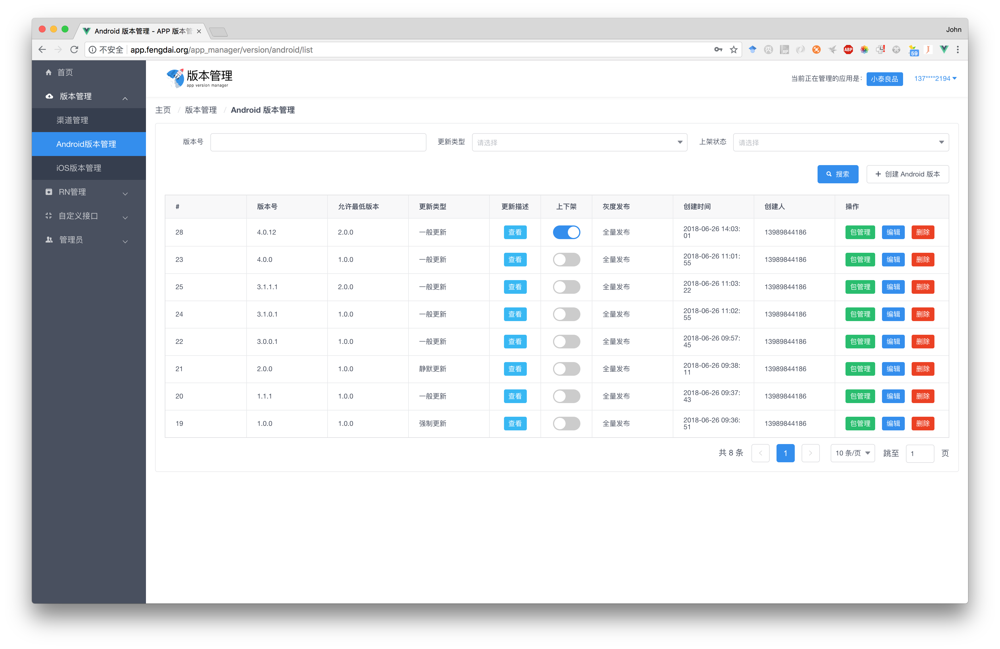
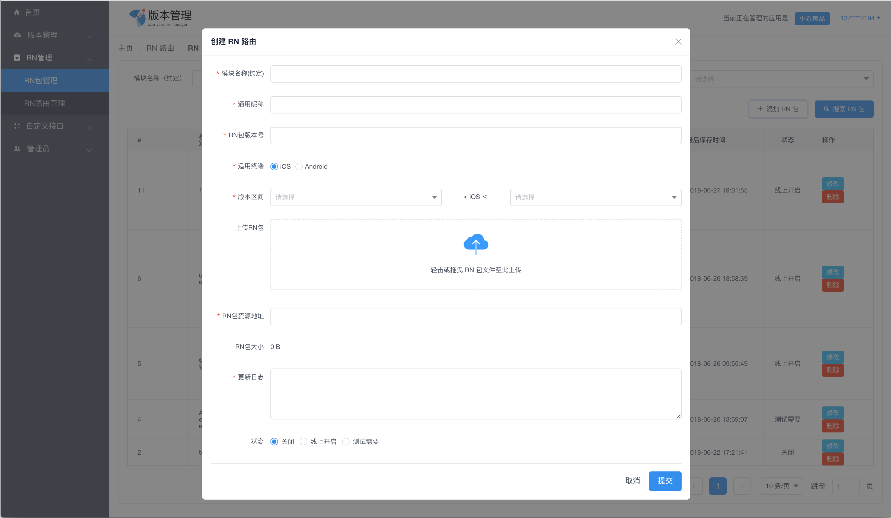

image::web/dashboard/src/images/logo.png[logo,200,200,align="center"]


## APP版本管理系统


image::https://img.shields.io/badge/Release-1.0.0-blue.svg?style=flat-square&logo=appveyor[]

APP版本管理是一套多应用更新发版的管理平台。用户可以通过部署本管理系统，以实现对多APP的多平台多渠道上的版本管理。


### 项目结构

```
app-version
│   README.md
└───modules
│   └───app-version-common (公共代码 实体类 工具类等)
│   └───app-version-manager (后台管理模块)
│   └───app-version-rest (与APP交互的Rest接口模块)
└───web
    └───dashboard (前端)
```

### 项目预览
本项目使用iView框架搭建，简洁美观。



